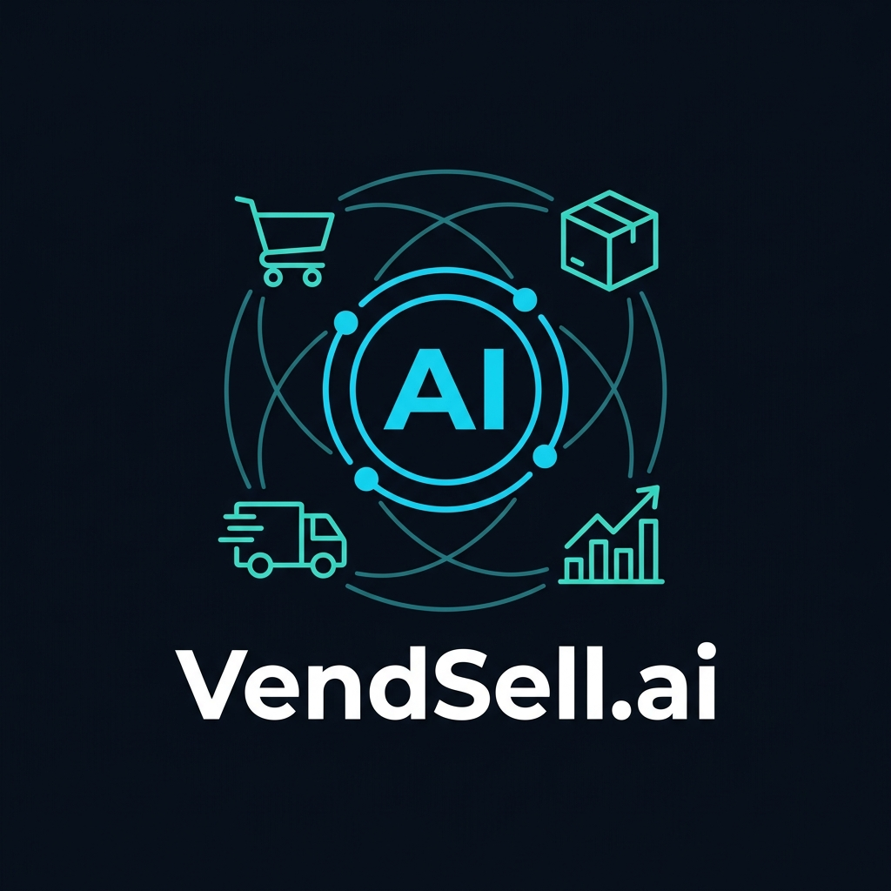

<div align="center">
  
  <h1> VendSell.ai</h1>
  <p><b>Retail Intelligence & Autonomous Supply Chain AI Engine</b></p>
  <p>
    
    
    
    
  </p>
</div>

> **VendSell.ai** is a state-of-the-art, AI-powered Retail Analytics & Supply Chain Management platform built for the modern retail ecosystem. We bridge the gap between Selling Places (Retailers) and Vendors (Suppliers) using an intelligent, autonomous microservice architecture. 

---

##  About the Project

In today's fast-paced retail environments, supply chain friction—such as unpredictable stockouts, dead inventory, and strained supplier negotiations—costs businesses millions of dollars in lost margin and capital lockup. 

**VendSell.ai** was engineered to solve this through complete automation. By utilizing the power of **Hugging Face's Llama-3.1-8B** and **Neon Serverless Postgres**, the platform moves beyond simple dashboards. It actively monitors sales velocities, predicts demand crashes, analyzes expiration dates, and uses specialized AI Agents to take real-world actions on your behalf—like drafting liquidation strategies, generating SEO marketing copy from photos, and writing purchase orders directly to suppliers. 

The goal? Zero-touch retail operations where you simply oversee AI-driven recommendations in a beautifully crafted, high-contrast glassmorphic dashboard.

---

##  The AI Workforce: Specialized Autonomous Agents

VendSell.ai employs a fleet of modular, specialized AI agents designed to automate the heavy lifting of retail operations. Together, they act as an autonomous back-office team running 24/7.

###  1. Procurement & Fulfillment Agent
* **Autonomous Restocking**: Analyzes real-time stockout risks and automatically drafts professional Purchase Order (PO) emails for your suppliers.
* **Context-Aware Urgency**: Adapts its tone and urgency level dynamically based on calculated lead times and remaining safety stock buffer.
* **Zero-Touch Execution**: Eliminates the manual overhead of writing vendor communications, providing a copy-paste ready PO instantly tailored to current demand.

###  2. Dynamic Pricing & Liquidation Agent
* **Margin Preservation**: Constantly monitors product expiration timelines against current sales velocities to calculate the mathematically optimal markdown percentage.
* **Strategic Liquidation Plans**: Suggests real-world actions like cross-category bundle deals and high-visibility shelf placements to move inventory without bleeding unnecessary profit.
* **Continuous Adjustment**: Re-evaluates its recommended strategies every single day as inventory draws closer to its expiration date.

###  3. SEO & Marketing Generation Agent
* **Vision-to-Text Pipeline**: Ingests raw OCR data from physical product tag scans (multimodal vision processing) and expands sparse data into fleshed out eCommerce descriptions.
* **SEO Optimization**: Generates organic, high-converting product copy tailored for digital storefronts, instantly bridging the physical-to-digital retail gap.
* **Metadata Automation**: Automatically appends relevant marketing hashtags and metadata to accelerate time-to-market for newly stocked items.

###  4. Vendor Relationship & Escalation Agent
* **Supplier Scoring Engine**: Continuously tracks your suppliers on fulfillment scores, order completion speeds, and PO rejection percentages.
* **Negotiation Drafting**: Drafts firm, professional escalation emails to underperforming vendors, calling out their statistical drop-offs over recent periods.
* **Automated Accountability**: Streamlines the friction of supplier negotiations by arming retail managers with AI-generated, purely data-backed communications.

###  5. Core Orchestration (Tool-Routing) Agent
* **Dynamic Intelligence Hub**: The primary system orchestrator that intercepts user chat queries in natural language and dynamically routes them to internal database functions.
* **Autonomous Data Retrieval**: Independently decides when to trigger internal lookup tools for low stock items, expiring batches, and supplier contact cards without hard-coded rules.
* **Contextual Formatting**: Delivers highly concise, beautifully formatted markdown summaries directly into the Chatbot UI, translating raw JSON data into human-readable insights.

---

##  Platform Capabilities

###  Automated Inventory Analytics & Risk Management
* **ABC/XYZ Classification**: Automatically categorizes products by revenue contribution (ABC) and demand volatility (XYZ) to help prioritize capital allocation.
* **Stockout Risk Matrix**: Predicts exact stockout dates based on daily run rates, factoring in lead times, and highlights critical shortages with actionable insights.
* **Margin Health & Ghost SKUs**: Identifies dead stock (zero sales) and flags low-profit margin items to trigger automated markdown liquidation strategies.
* **EOQ & Safety Stock Calculation**: AI determines the Economic Order Quantity and dynamic reorder points based on rolling average daily sales velocity.

###  Multimodal OCR Vision Catalog Scanning
* **Product Tag Recognition**: Eliminate manual data entry. Scan physical product tags, supplier barcodes, or receipt photos to automatically extract product titles, SKUs, prices, categories, and batch numbers.
* **Seamless Database Sync**: Extracted product metrics are automatically pushed to the Neon Postgres database.

---

##  Executive Dashboards (Dark Glassmorphism)
* **Stock Availability & ABC Intelligence**: Visualizes inventory proportions, revenue contribution by class, and dynamic pie charts.
* **SVG Gradient Area Curves**: Smooth, animated sales throughput charts and expiry timeline visualizations.
* **Modern Typography**: Tailored, premium dark theme design featuring glassmorphism micro-animations for an ultra-modern user experience.

---

##  Architecture & Technology Stack

The platform is designed around a modern Serverless microservices architecture, completely optimized for deployment on Vercel.

* **Frontend**: React 18, Vite 5, Material-UI (MUI v5), Recharts.
* **Backend API**: Node.js / Express fallback, seamlessly transpiled into Vercel Serverless Functions.
* **Database**: **Neon Serverless Postgres** integrated via the standard `pg` driver, offering instantaneous cold starts and connection pooling.
* **AI Engine Microservice**: Python 3.10+, FastAPI (Serverless), Uvicorn.
* **LLM Provider**: Hugging Face Inference Router (`meta-llama/Llama-3.1-8B-Instruct`).
* **Deployment**: Vercel (Edge Config, Serverless Node.js, and Serverless Python Functions).

---

##  Getting Started

### Prerequisites
* **Node.js**: v18.0.0+
* **Python**: v3.9+
* **PostgreSQL**: A local Postgres instance or a free Neon.tech Postgres cluster.

### 1. Installation
Clone the repository and install dependencies across all microservices:
```bash
git clone https://github.com/harshith0406/VendSell.ai.git
cd VendSell.ai

# Install Express backend dependencies
cd backend && npm install

# Install React frontend dependencies
cd ../frontend && npm install

# Install Python FastAPI dependencies
cd ../ai_service && pip install -r requirements.txt
```

### 2. Running Locally (Development Mode)
You can run all three services simultaneously using the root startup script:
```bash
npm start
```
*or double-click `start-all.bat` on Windows.*

The services will bind to the following local ports:
* **Express Core API**: `http://localhost:5000`
* **Python AI Microservice**: `http://127.0.0.1:8000`
* **Vite React Frontend**: `http://localhost:5173`

---

##  Deployment to Vercel

This repository is fully optimized for **Vercel Serverless Deployment**. It features a custom `vercel.json` and a `vc_init.py` adapter to natively host the FastAPI python service on Vercel's Python runtime without requiring Docker.

1. Connect your GitHub repository to Vercel.
2. Vercel will automatically detect the Vite frontend and the Serverless backend based on `vercel.json`.
3. Ensure your production environment keys are supplied.
4. Click **Deploy**. Vercel will build the frontend, deploy the Node.js API to `/api/*`, and deploy the FastAPI endpoints to `/api/python/*`.

---

##  License
MIT License  2026 VendSell.ai Team.
